# Тестування працездатності системи

# Тестування працездатності системи ІО-24 Слободенюк Олександр
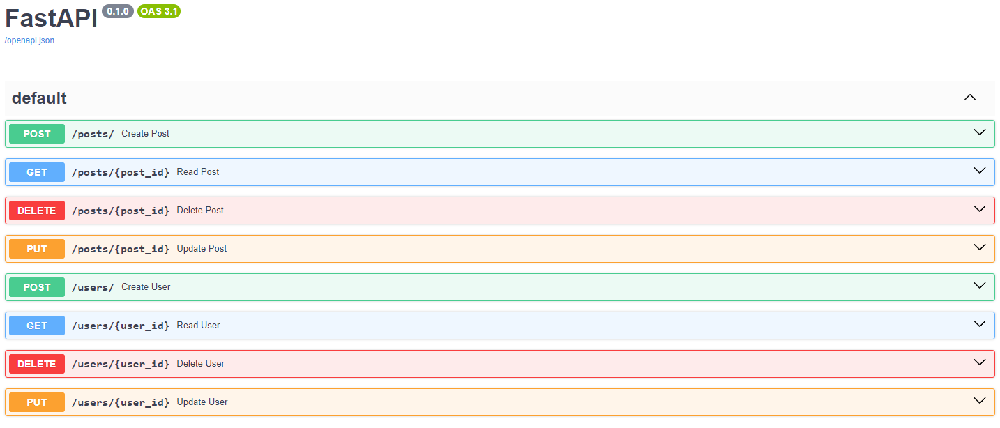
## CRUD
[CRUD](https://highload.today/uk/shho-take-crud-prostimi-slovami-funktsiyi-perevagi-ta-prikladi/) — це скорочення від англійських слів, що позначають чотири операції:
    
Create (створювати);
Update (оновлювати);
Read (читати);
Delete (видаляти).

### Create
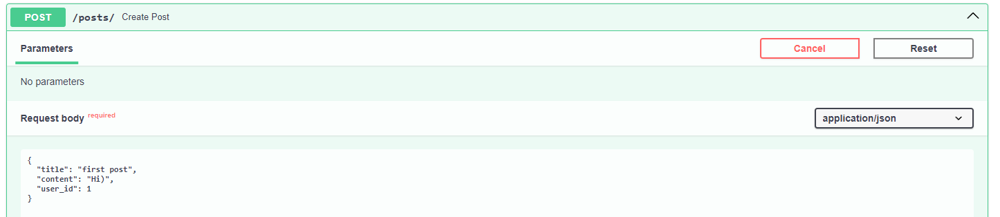
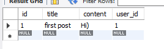
### Read
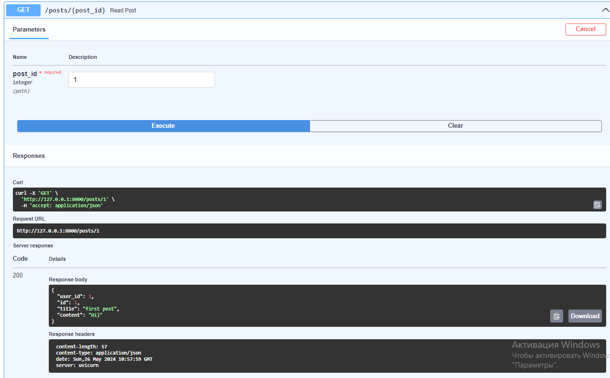

### Update
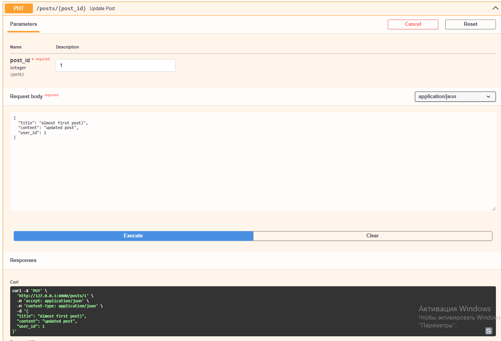
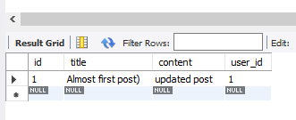

### Delete
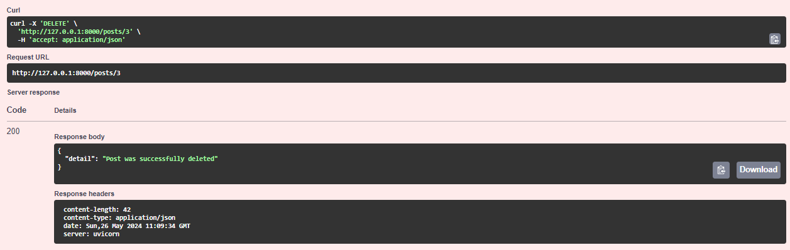
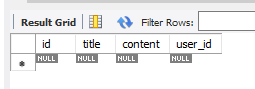

Так само буде працювати з табличкою Users

### Start_Server
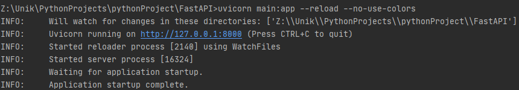

### Code

Працездатність ендпоінтів для Posts
 
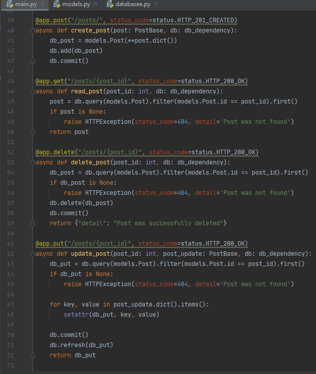

Працездатність ендпоінтів для Users

Підключення до бд MySQL Workbench

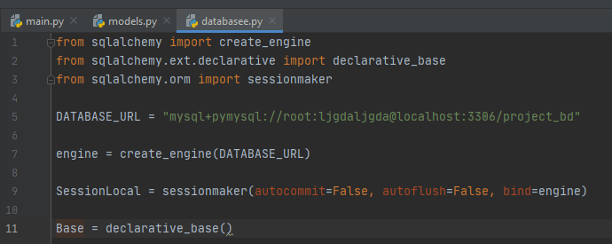